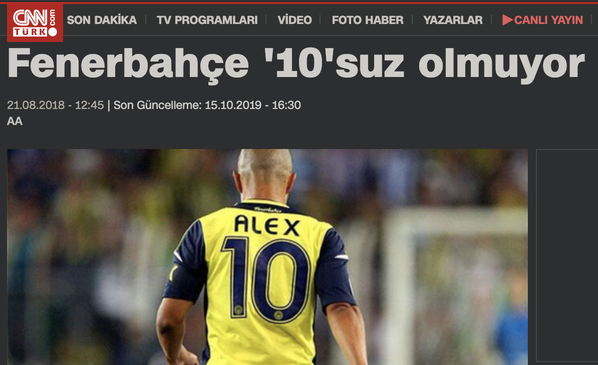
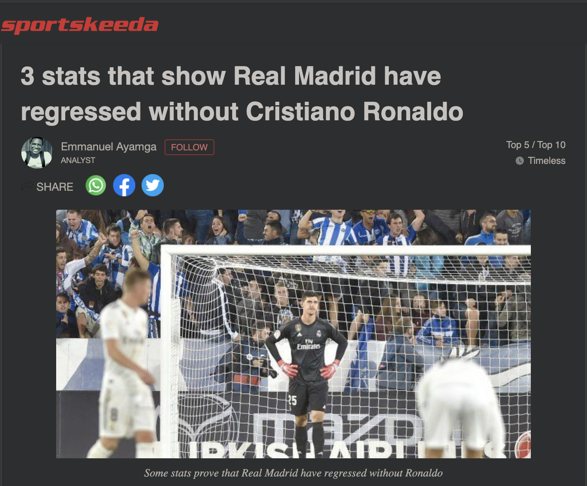

# soccer-player-archetype-clustering
Clustering soccer players using by using FIFA 2019 player attributes data.

Emre Dogan  
January 19, 2020

## Motivation
- Replacing an important player in a soccer team is a critical task.
- Clubs fail to replace these players after they retire/leave.

News for Alex de Souza     |  News for Cristiano Ronaldo
:-------------------------:|:-------------------------:
  |  

- Finding similar players having a common gameplaying archetype might help clubs to replace these players more easily.

## Dataset
(FIFA 19 complete player dataset.)[https://www.kaggle.com/karangadiya/fifa19]

