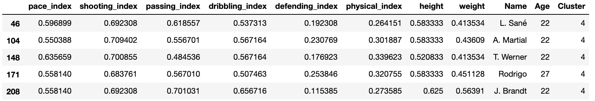

# Soccer Player Archetype Clustering
A new approach in soccer scouting: Clustering soccer players by using FIFA 2019 player attributes dataset.

## Motivation
- Replacing an important player in a soccer team is a critical task.
- Clubs fail to replace these players after they retire/leave.

News for the break-up of Alex de Souza     |  News for the break-up of Cristiano Ronaldo
:-------------------------:|:-------------------------:
  |  

- Finding similar players having a similar gameplaying archetype might help clubs to replace these players more easily.

## Dataset
- [FIFA 19 complete player dataset.](https://www.kaggle.com/karangadiya/fifa19)

- 88 different informative attributes for each player.
- Within this study, position attributes (i.e. LS, ST, ST, RS) are not used. (might be a good future work.)

## Approach
First, by using the attributes of each player, some new features are generated in the following way:

| Generated Features| Attributes Used|
| ------------- |:-------------:|
| Pace     | Acceleration, Sprint Speed|
| Shooting | Finishing, LongShots, Penalties, Positioning, ShotPower, Volleys|
| Passing | Crossing, Curve, FKAccuracy, LongPassing, ShortPassing, Vision|
| Dribbling | Agility, Balance, BallControl, Composure, Dribbling, Reactions|
| Defending | HeadingAccuracy, Interceptions, Marking, StandingTackle, SlidingTackle|
| Physical | Aggression, Jumping, Stamina, Strength|

Each generated feature is concluded by averaging the corresponding attribute stats. Also, height and weight columns are used after being cleaned (removing punctuations and unit abbreviations).

The idea of averaging these attributes comes from FIFA game series itself. In FIFA player cards, 6 main player stats (pace, shooting, passing, dribbling, defending and physical) are generated from these attributes.

  

Figure Reference: <a href="https://www.futbin.com/stats-calculator">here.</a>

Then, by considering all these features, k-means clustering algorithm is used in order to maximize the intra-class similarity and minimize the interclass similarity between players.

**How to decide the optimal number of clusters (k value) ?**  
Deciding on k value(number of clusters) is a critical step in clustering task. There are many different appraoches to decide k value, the most popular one: elbow method. 

*Elbow method* is a heuristic to determine the optimal number of clusters, by selecting the value of k at the “elbow” ie the point after which the distortion/inertia start decreasing in a linear fashion. In order to see optimal k value, a range of values [2, 15] is used as k value to observe the distortion as a result of clustering task.

  

Elbow method tell us to choose k value as 3 or 4. However, it is obvious that there are many more soccer player archetypes. For this reason, I picked k value 7.

## Results 

After resulting with 7 different clusters, I analyzed each cluster and named it with respect to its characteristics. General info on each cluster is given below with 5 representative players:

### Cluster 0 (classy creator): 
- These players are very important for the playmaking process.
- They represent a transition between defence and attack.
- Characteristics:
    - __very good__ at passing.
- Examples: Kevin De Bruyne, Luka Modric, etc.

*Figure: Top 5 players of the classy creator cluster*

### Cluster 1 (genuine defender): 
- This cluster consists of the solid defender players(most of the time centre-backs).
- They are mostly not responsible for playmaking. Their genuine duty is to stop opponent attackers by tackling etc.
- Characteristics: 
    - __very good__ defending and physical stats.
    - most of the time, tall players.
- Examples: Diego Godin, Chiellini, Koulibaly, etc.

*Figure: Top 5 players of the genuine defender cluster*

### Cluster 2 (zig-zag dribbler): 
- This kind of players are quite effective in dribbling inside the penalty area.
- They are not famous for very fast sprints, but they are more comfortable with zig-zag dribblings.
- Characteristics:
    - low physical power.
    - __very good__ at dribbling and shooting.
- Examples: Lionel Messi, Neymar, Eden Hazard, etc. 

*Figure: Top 5 players of the zig-zag dribbler cluster*

### Cluster 3 (solid scorer): 
- These players are considered as the main goal change for their teams.
- They are not famous for very fast sprints, but they are more comfortable with zig-zag dribblings.
- Characteristics:
    - __very good__ shooting skills.
    - good physical stats.
- Examples: C. Ronaldo, Luis Suarez, etc.

*Figure: Top 5 players of the solid scorer cluster*

### Cluster 4 (cheetah scorer): 
- This kind of players are quite effective in the empty space.
- They are famous for their very fast sprints. 
- Characteristics:
    - low physical power.
    - quite fast players.
    - __very good__ at dribbling and shooting.
- Examples: Leroy Sane, Anthony Martial, etc.

*Figure: Top 5 players of the cheetah scorer cluster*

### Cluster 5 (playmaker defender): 
- This cluster consists of defenders (mostly centre-back and rarely defensive midfielder).
- They are good at passing and shooting. This makes them special as this kind of players are responsible for playmaking (i.e. starting point of the attack organizations.) 
- Characteristics:
    - good defending skills (not surprising).
    - __good__ at passing and shooting.
- Examples: Sergio Ramos, Sergio Busquets, etc.

*Figure: Top 5 players of the playmaker defender cluster*

### Cluster 6 (fast defender): 
- Defenders with high velocity.
- Not a very good seperated cluster. It is a combination of left/right back players and speedy defensive midfielder.
- Characteristics: high speed, good physical stats.
- Examples: N. Kante, Carvajal, etc. 

*Figure: Top 5 players of the fast defender cluster*

## Average Statistics for Each Cluster

*Figure: Characteristics of All Archetypes*

## Conclusion 
- Young defenders appear in the clusters _fast defender_ and _genuine defender_. As they get older, they tend to improve their playmaking skills (playmaker defender).

- _cheetah scorers_ are more likely the young wing-forwards while _solid scorers_ are more experienced players.

- _zig-zag dribblers_ have very bad physical stats such as aggression, jumping, stamina, strength. Although it looks like a disadvantage, this characteristic probably lets them show their dribbling skills in a better way.

- Players with the best physical stats are in the cluster _genuine defender_.

## Future Work
- There is still a lot to improve for this project. Some future ideas:
  - FIFA provides position skills for each player (i.e. LS, ST, ST, RS). Using them might give better results in terms of players finding players that can play in the same/similar positions.
  - FIFA provides a _Potential_ attribute for players, as a measure of being a promising young player. Using this attribute might help to find young & cheap players in order to replace retiring/leaving players in the team.
  - __Better feature engineering:__ It is a challenging task to achieve good features leading a good discrimination between data instances. Coming up with better features will definitely improve the clustering success.

Emre Dogan  
January 20, 2020